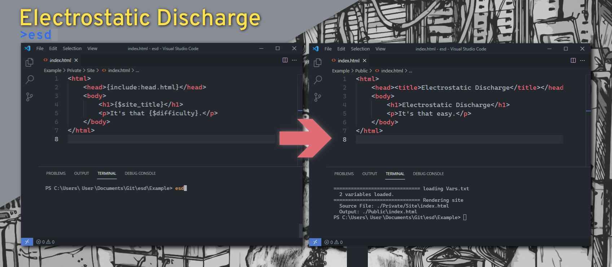

    

# Electrostatic Discharge

Electrostatic Discharge (esd) is here to take the pain out of making static websites. It's a minimal templating tool for html, css and javascript.

Unlike alternative options it takes seconds to learn and runs faster than you can type `esd`.

## Download

Release: [v0.1](https://github.com/xoorath/esd/releases/tag/v0.1)

[Linux x64](https://github.com/xoorath/esd/releases/download/v0.1/ESD.Linux.zip) | [Windows x64](https://github.com/xoorath/esd/releases/download/v0.1/ESD.Win64.zip) | [Windows x86](https://github.com/xoorath/esd/releases/download/v0.1/ESD.Win32.zip) | [MacOS](https://github.com/xoorath/esd/releases/download/v0.1/ESD.MacOS.zip)

Or you can [build it yourself](Docs/Build.md).

## Features

**There are only 3 features.**

Your website defined in `/Private/Site/*` is transformed with these three features and output into `/Public/*`.

1. Files may be included from `/Private/Components/*` with `{include:file_name}`
2. Variables can be declared in a global `./Vars.txt` or in any source file with `{variable:variable_name=example}`.
3. Variables can be substituted with `{$variable_name}`.

## Docs

See the [docs](/Docs/Readme.md) page to learn more about building and using esd.

## License

See the [LICENSE](LICENSE.md) file.
